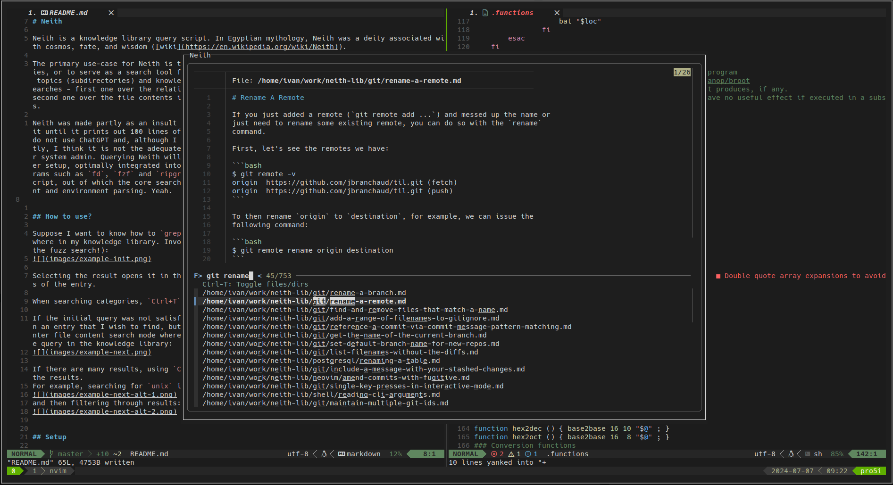
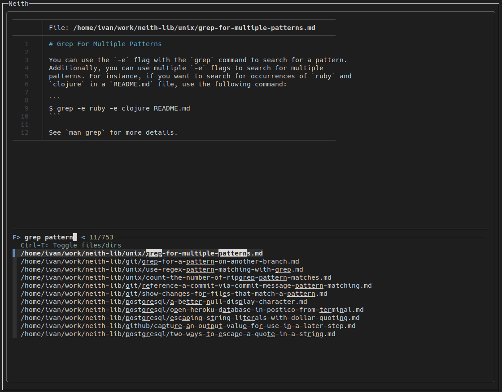
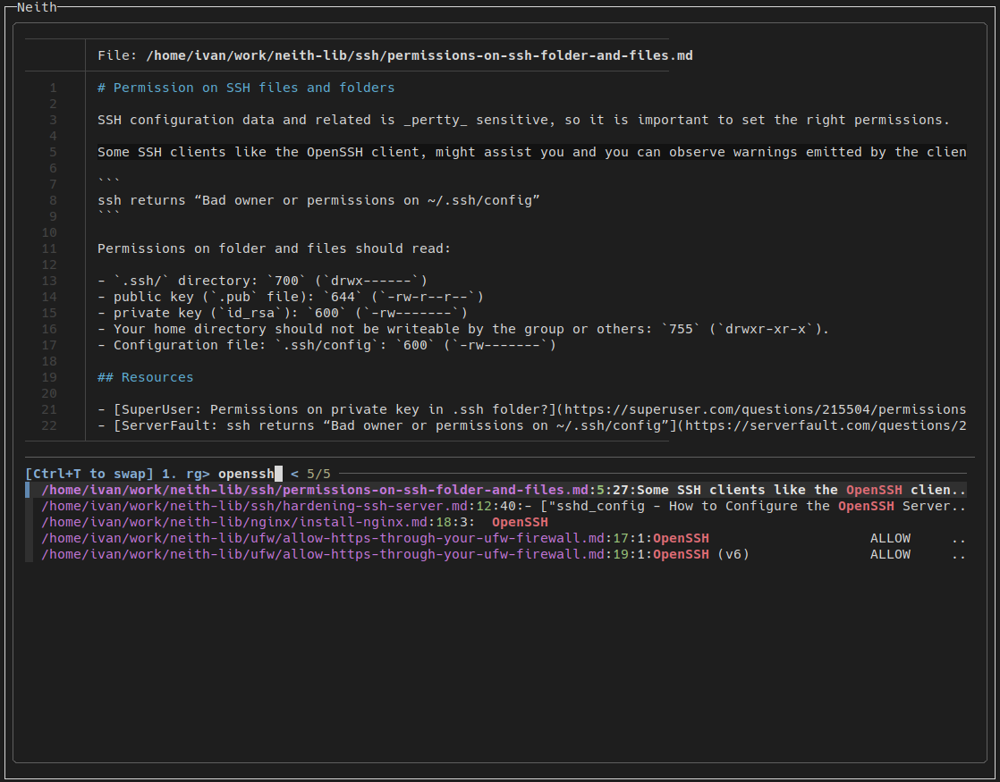
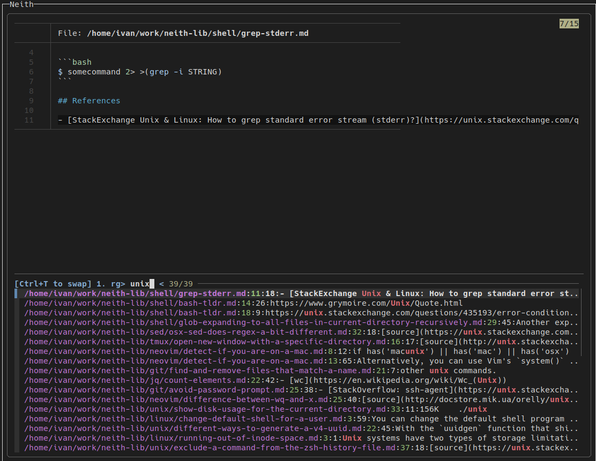
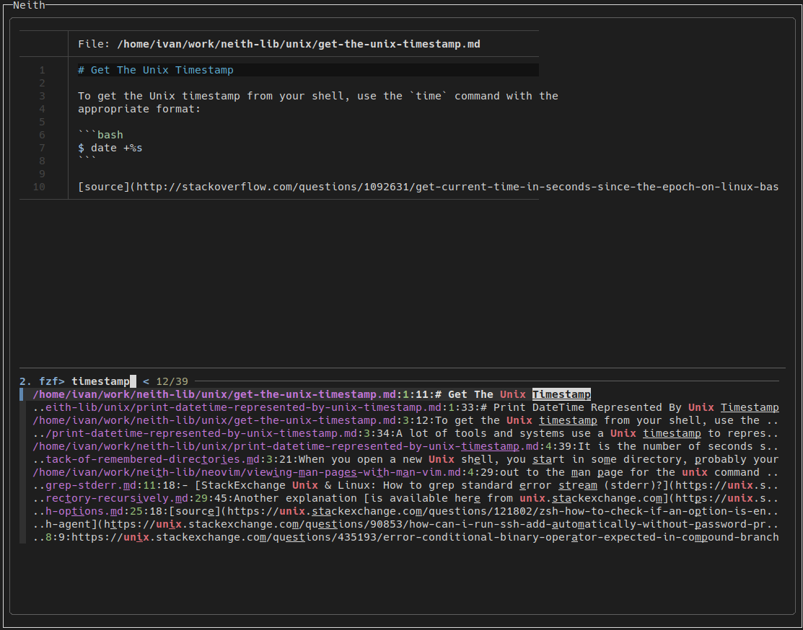
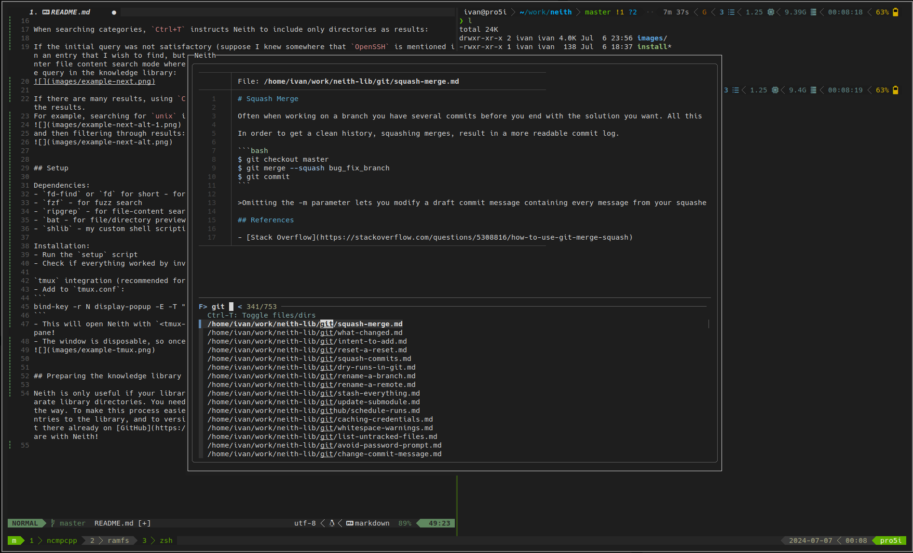

# Neith



Neith is a knowledge library query script. In Egyptian mythology, Neith was a deity associated with cosmos, fate, and wisdom ([wiki](https://en.wikipedia.org/wiki/Neith)).

The primary use-case for Neith is to provide **real-time** and **correct** answers to often repeated queries, or to serve as a search tool for libraries. A *library* is a structured directory containing topics (subdirectories) and knowledge entries (files) prepared as an index. Neith has one search window with modes for library paths and file contents.

Neith was made partly as an insult to people who ask ChatGPT common programming questions, and wait until it prints out 100 lines of random text and a solution that might not even be correct. I do not use ChatGPT and, although I do agree there are use-cases for it where it performs brilliantly, I think it is not the adequate tool for answering quick questions typical for a programmer or system admin. Querying Neith will give you **correct** answers in **real-time** while you are typing, almost **instantly** (with proper setup, optimally integrated into tmux), and the search is performed by **blazingly fast** programs such as `fd`, `fzf` and `ripgrep`.


## How to use?

Suppose I want to know how to `grep` over multiple patterns, and I know I have that recorded somewhere in my knowledge library. Invoking Neith with a query like `grep pattern` opens `F:file>` mode and fuzzily searches files:


Selecting the result opens it in the chosen `$EDITOR` (for me, neovim), so you can view/copy parts of the entry.

`Ctrl+T` toggles `F:file>` and `F:dir>` while staying in the same window. In `F:file>`, Neith also checks the first word of the query as a man-page title. If it resolves, Neith renders every matching man page to temporary text files and includes those files in the search results, so a symbol such as `printf` can show both `printf(1)` and `printf(3)` when both are installed.

Press `Tab` to switch between path search and content search. Content search starts in `C:regex>` and uses case-insensitive `rg` regex matching. `Ctrl+T` toggles `C:regex>` and `C:lit>`, where `C:lit>` uses fixed-string matching. `Esc` closes Neith.


In content mode, man-page search uses the first word as the man-page title and searches the remaining query text inside all matching rendered man pages. If there is no remaining text, it searches for the title. To restrict to one manual section, use `name(section)` or `section name`, for example `printf(3) format` or `3 printf format`.

If there are many results, press `Ctrl+F` to freeze the current results and start a fresh fuzzy filter with an empty query. Press `Ctrl+F` again to restore the previous live query and mode.
For example, searching for `unix` in content search mode:

and then filtering through results:


Press `Ctrl+A` to create a new note from the current live query. Neith switches to `A:dir>` mode, where Enter selects an existing destination directory or creates the typed directory when there is no match. The note is created from the Neith repo's `.neith-note-template.md`, named with a lower-kebab-case slug, and opened in `$EDITOR`. Press `Ctrl+A` again to cancel add mode.


## Setup

Dependencies:
- `fd-find` or `fd` for short - for filename search 
- `fzf` - for fuzz search
- `ripgrep` - for file-content search
- `bat` - for file/directory previews
- `man` and `col` - for rendered man-page results
- `shlib` - my custom shell scripting library bundled in this repository

Installation:
- Run the `setup` script
- Check if everything worked by invoking `neith`

Setting the library:
- Set the `NEITH_LIBS` environment variable in your shell `.profile` file
- If you have multiple libraries you wish to query with Neith, use `:` to separate them

`tmux` integration (recommended for maximum efficiency):
- Add to `tmux.conf`:
```sh
bind-key -r N display-popup -E -T "Neith" -h "80%" -w "60%" "neith"
```
- This will open Neith with `<tmux-prefix> + Shift+n` without the need for a new terminal window/pane!
- The window is disposable, so once it closes you go back to your workflow



## Preparing the knowledge library

Neith can work with an arbitrary amount of separate library directories. You need to make the commitment to _record_ things you discover along the way. To make this process easier, Neith adds `Ctrl+A` in the search UI and a `-a` flag for creating new entries. For example, `neith -a bash "enable strict mode"` creates or opens `bash/enable-strict-mode.md` from the Neith repo's `.neith-note-template.md`. Running `neith -a bash` without a query keeps the old behavior of opening the target path in `$EDITOR`. There are several excellent libraries out there already on [GitHub](https://github.com/topics/today-i-learned), that can be used as-they-are with Neith!

Neith is only useful if your library is extensive, and this is the main weakness of Neith, as most people do not have the patience to do this. I personally find Neith useful for those not-so-simple answers that I know I need to save for the future because I browsed for hours to find them and don't want to repeat that again. For all the simple queries, Google or Stack Overflow is your friend. If you Google something more than once, save it in the library. Neith does not aim to replace tools such as [cht.sh](https://github.com/chubin/cheat.sh) and similar, nor should you stop using them if you use Neith. I think the combination of the two is best for most people, and can be achieved with something like the following in the tmux integration (depending on which tool you use more often, put that tool first):
```sh
bind-key -r N display-popup -E -T "Neith" -h "80%" -w "60%" "cht.sh --shell || neith"
```
Or simply create a script that wraps around the two programs in the way you like the most.
