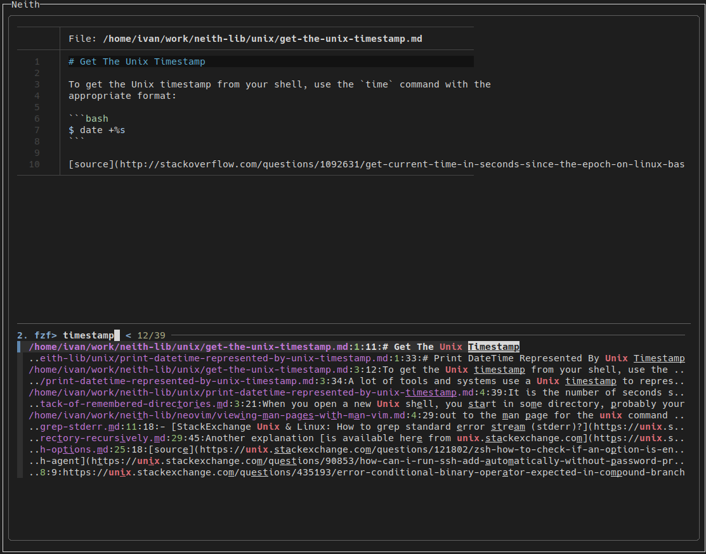

# Neith


Neith is a knowledge library query script. In Egyptian mythology, Neith was a deity associated with cosmos, fate, and wisdom ([wiki](https://en.wikipedia.org/wiki/Neith)).

The primary use-case for Neith is to provide **real-time** and **correct** answers to often repeated queries, or to serve as a search tool for libraries. A *library* is a structured directory containing topics (subdirectories) and knowledge entries (files) prepared as an index. Neith performs two searches - first one over the relative library paths to quickly find files matching the query, or second one over the file contents in cases where the first search doesn't retrieve desired results.

Neith was made partly as an insult to people who ask ChatGPT common programming questions, and wait until it prints out 100 lines of random text and a solution that might not even be correct. I do not use ChatGPT and, although I do agree there are use-cases for it where it performs brilliantly, I think it is not the adequate tool for answering quick questions typical for a programmer or system admin. Querying Neith will give you **correct** answers in **real-time** while you are typing, almost **instantly** (with proper setup, optimally integrated into tmux), and the search is performed by **blazingly fast** programs such as `fd`, `fzf` and `ripgrep`. And all of that is available in **~150** lines of shell script, out of which the core search logic is implemented in less than 40, the rest is just argument and environment parsing. Yeah.


## How to use?

Suppose I want to know how to `grep` over multiple patterns, and I know I have that recorded somewhere in my knowledge library. Invoking Neith with a query like `grep pattern` retrieves (notice the fuzz search!):


Selecting the result opens it in the chosen `$EDITOR` (for me, neovim), so you can view/copy parts of the entry.

When searching categories, `Ctrl+T` instructs Neith to include only directories as results:

If the initial query was not satisfactory (suppose I knew somewhere that `OpenSSH` is mentioned in an entry that I wish to find, but don't know the name of it), pressing `Esc` or `Ctrl+C` will enter file content search mode where exact matching is used. Neith will print all occurances of the query in the knowledge library:


If there are many results, using `Ctrl+T` in this mode instructs Neith to fuzzily filter through the results.
For example, searching for `unix` in content search mode:

and then filtering through results:



## Setup

Dependencies:
- `fd-find` or `fd` for short - for filename search 
- `fzf` - for fuzz search
- `ripgrep` - for file-content search
- `bat` - for file/directory previews
- `shlib` - my custom shell scripting library bundled in this repository

Installation:
- Run the `setup` script
- Check if everything worked by invoking `neith`

Setting the library:
- Set the `NEITH_LIBS` environment variable in your shell `.profile` file
- If you have multiple libraries you wish to query with Neith, use `:` to separate them

`tmux` integration (recommended for maximum efficiency):
- Add to `tmux.conf`:
```sh
bind-key -r N display-popup -E -T "Neith" -h "80%" -w "60%" "neith"
```
- This will open Neith with `<tmux-prefix> + Shift+n` without the need for a new terminal window/pane!
- The window is disposable, so once it closes you go back to your workflow


## Preparing the knowledge library

Neith can work with an arbitrary amount of separate library directories. You need to make the commitment to _record_ things you discover along the way. To make this process easier, Neith adds a flag `-a` that allows you to quickly add new entries to the library, and to version control libraries. There are several excellent libraries out there already on [GitHub](https://github.com/topics/today-i-learned), that can be used as-they-are with Neith! 

Neith is only useful if your library is extensive, and this is the main weakness of Neith, as most people do not have the patience to do this. I personally find Neith useful for those not-so-simple answers that I know I need to save for the future because I browsed for hours to find them and don't want to repeat that again. For all the simple queries, Google or Stack Overflow is your friend. If you Google something more than once, save it in the library. Neith does not aim to replace tools such as [cht.sh](https://github.com/chubin/cheat.sh) and similar, nor should you stop using them if you use Neith. I think the combination of the two is best for most people, and can be achieved with something like the following in the tmux integration (depending on which tool you use more often, put that tool first):
```sh
bind-key -r N display-popup -E -T "Neith" -h "80%" -w "60%" "cht.sh --shell || neith"
```
Or simply create a script that wraps around the two programs in the way you like the most.

